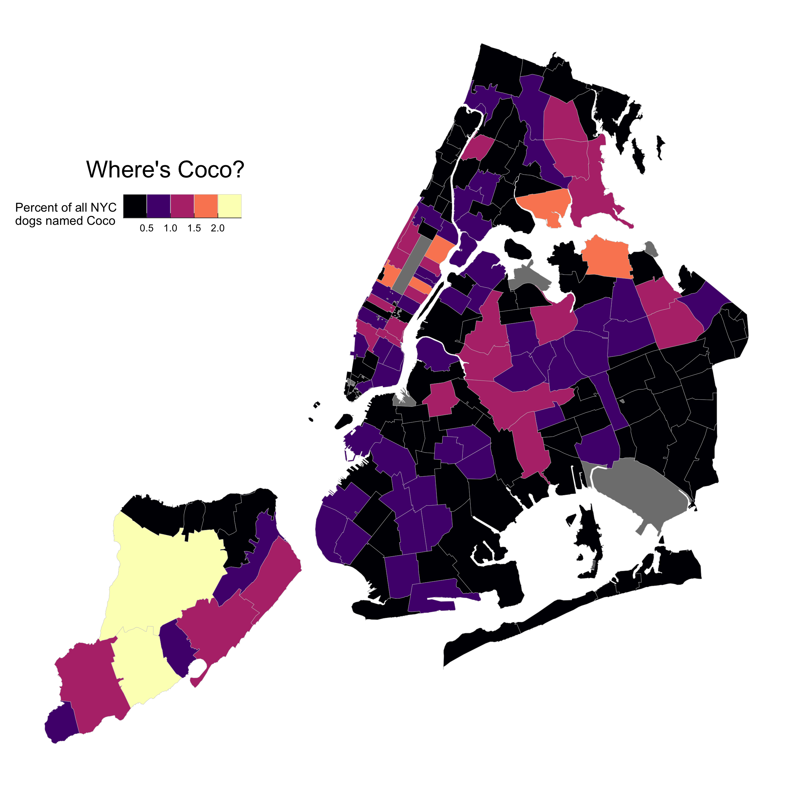

<!-- README.md is generated from README.Rmd. Please edit that file -->

# nycdogs 

<!-- badges: start -->

[](https://github.com/kjhealy/nycdogs/actions)

<!-- badges: end -->

The `nycdogs` package contains three datasets, `nyc_license`,
`nyc_bites`, and `nyc_zips`. They contain, respectively, data on all
licensed dogs in New York city, data on reported dog bites in New York
city, and geographical data for New York city at the zip code level.

## Installation

`nycdogs` is a data package, bundling several datasets into a convenient
format. The relatively large size of the data in the package means it is
not suitable for hosting on [CRAN](https://cran.r-project.org/), the
core R package repository. Install the package from
[GitHub](https://github.com/kjhealy/nycdogs) with:

``` r
remotes::install_github("kjhealy/nycdogs")
```

## Loading the data

The package works best with the [tidyverse](http://tidyverse.org/)
libraries and the [simple
features](https://r-spatial.github.io/sf/index.html) package for
mapping.

``` r
library(tidyverse)
#> ── Attaching core tidyverse packages ──────────────────────── tidyverse 2.0.0 ──
#> ✔ dplyr     1.1.4     ✔ readr     2.1.5
#> ✔ forcats   1.0.0     ✔ stringr   1.5.1
#> ✔ ggplot2   3.5.1     ✔ tibble    3.2.1
#> ✔ lubridate 1.9.4     ✔ tidyr     1.3.1
#> ✔ purrr     1.0.2     
#> ── Conflicts ────────────────────────────────────────── tidyverse_conflicts() ──
#> ✖ dplyr::filter() masks stats::filter()
#> ✖ dplyr::lag()    masks stats::lag()
#> ℹ Use the conflicted package (<http://conflicted.r-lib.org/>) to force all conflicts to become errors
library(sf) # this is required!
#> Linking to GEOS 3.11.0, GDAL 3.5.3, PROJ 9.1.0; sf_use_s2() is TRUE
```

Load the data:

``` r
library(nycdogs)
```

To look at the tibble that contains the licensing data, do this:

``` r
nyc_license
#> # A tibble: 493,072 × 9
#>    animal_name animal_gender animal_birth_year breed_rc         borough zip_code
#>    <chr>       <chr>                     <dbl> <chr>            <chr>      <int>
#>  1 Paige       F                          2014 Pit Bull (or Mi… Manhat…    10035
#>  2 Yogi        M                          2010 Boxer            Bronx      10465
#>  3 Ali         M                          2014 Basenji          Manhat…    10013
#>  4 Queen       F                          2013 Akita Crossbreed Manhat…    10013
#>  5 Lola        F                          2009 Maltese          Manhat…    10028
#>  6 Ian         M                          2006 Unknown          Manhat…    10013
#>  7 Buddy       M                          2008 Unknown          Manhat…    10025
#>  8 Chewbacca   F                          2012 Labrador (or Cr… Manhat…    10013
#>  9 Heidi-Bo    F                          2007 Dachshund Smoot… Brookl…    11215
#> 10 Massimo     M                          2009 Bull Dog, French Brookl…    11201
#> # ℹ 493,062 more rows
#> # ℹ 3 more variables: license_issued_date <date>, license_expired_date <date>,
#> #   extract_year <dbl>
```

## Example

You can use the `nyc_zips` object to create a map of, for example, where
dogs with a particular name live:

``` r

boro_names <- c("Manhattan", "Queens", "Brooklyn", 
                "Bronx", "Staten Island")

nyc_coco <- nyc_license |>
  filter(extract_year == 2016, 
         borough %in% boro_names) |> 
  group_by(zip_code, animal_name) |> 
  tally() |>
  ungroup() |>
  complete(zip_code, animal_name, 
           fill = list(n = 0)) |> 
  filter(animal_name == "Coco") |> 
  mutate(freq = n / sum(n),
           pct = round(freq*100, 2)) 


nyc_coco
#> # A tibble: 191 × 5
#>    zip_code animal_name     n    freq   pct
#>       <int> <chr>       <int>   <dbl> <dbl>
#>  1    10001 Coco            8 0.00932  0.93
#>  2    10002 Coco            7 0.00816  0.82
#>  3    10003 Coco            5 0.00583  0.58
#>  4    10004 Coco            1 0.00117  0.12
#>  5    10005 Coco            1 0.00117  0.12
#>  6    10006 Coco            0 0        0   
#>  7    10007 Coco            3 0.00350  0.35
#>  8    10009 Coco            8 0.00932  0.93
#>  9    10010 Coco            9 0.0105   1.05
#> 10    10011 Coco           10 0.0117   1.17
#> # ℹ 181 more rows

coco_map <- left_join(nyc_zips, nyc_coco)
#> Joining with `by = join_by(zip_code)`

## Map theme
theme_nymap <- function(base_size=9, base_family="") {
    require(grid)
    theme_bw(base_size=base_size, base_family=base_family) %+replace%
        theme(axis.line=element_blank(),
              axis.text=element_blank(),
              axis.ticks=element_blank(),
              axis.title=element_blank(),
              panel.background=element_blank(),
              panel.border=element_blank(),
              panel.grid=element_blank(),
              panel.spacing=unit(0, "lines"),
              plot.background=element_blank(),
              legend.justification = c(0,0),
              legend.position = "inside",
              legend.position.inside = c(0, 0.7), 
              legend.direction = "horizontal"
        )
}

coco_map |> ggplot(mapping = aes(fill = pct)) +
    geom_sf(color = "gray80", linewidth = 0.1) +
    scale_fill_binned(guide = "bins", type = "viridis", option = "A") +
    labs(fill = "Percent of all NYC\ndogs named Coco") +
  annotate(geom = "text", x = -74.16, y = 40.84, 
           label = "Where's Coco?", size = 6) + 
    theme_nymap() 
#> Loading required package: grid
```


