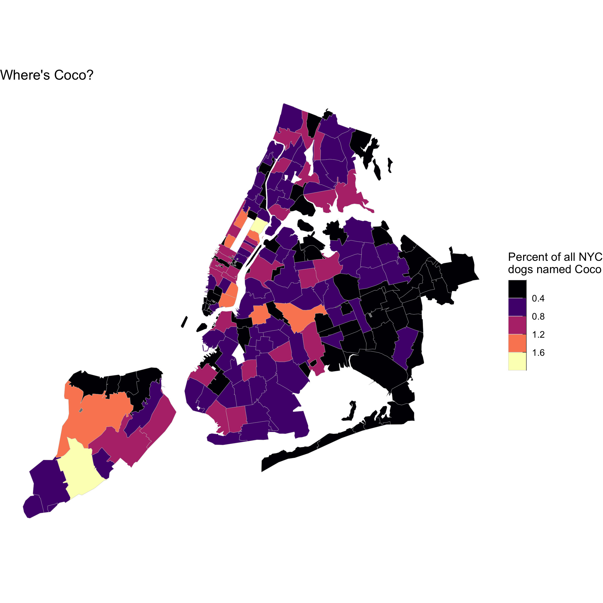

<!-- README.md is generated from README.Rmd. Please edit that file -->

# nycdogs 

<!-- badges: start -->

[](https://github.com/kjhealy/nycdogs/actions/workflows/R-CMD-check.yaml)
[](https://kjhealy.r-universe.dev/nycdogs)
<!-- badges: end -->

## Installation

`nycdogs` is a data package. I use it mostly to teach. Install it from
[GitHub](https://github.com/kjhealy/nycdogs) with:

``` r
# install.packages("pak")
pak::pak("kjhealy/nycdogs")
```

Alternatively, install it from my
[r-universe](https://kjhealy.r-universe.dev):

``` r
install.packages(
  "nycdogs",
  repos = c("https://kjhealy.r-universe.dev", "https://cloud.r-project.org")
)
```

The `https://cloud.r-project.org` entry lets R find the CRAN
dependencies automatically.

## The data

The `nycdogs` package contains two datasets, `nyc_license` and
`nyc_bites`.

- `nyc_license` has data on all licensed dogs in New York City, up to
  2026.
- `nyc_bites` has data on reported dog bites in New York City, from 2015
  to 2025.

Each table has a `breed_rc` column of recoded breed names. The two
columns use the same codes, so you can compare breeds between the
tables.

The package depends on [`nycmaps`](https://kjhealy.github.io/nycmaps/).
R attaches `nycmaps` automatically. `nycmaps` supplies the zip code
table and the zip code map that the examples use.

## Loading the data

The package works best with the [tidyverse](http://tidyverse.org/). Use
[simple features](https://r-spatial.github.io/sf/index.html) to draw
maps.

``` r
library(tidyverse)
#> ── Attaching core tidyverse packages ──────────────────────── tidyverse 2.0.0 ──
#> ✔ dplyr     1.2.1     ✔ readr     2.2.0
#> ✔ forcats   1.0.1     ✔ stringr   1.6.0
#> ✔ ggplot2   4.0.3     ✔ tibble    3.3.1
#> ✔ lubridate 1.9.5     ✔ tidyr     1.3.2
#> ✔ purrr     1.2.2     
#> ── Conflicts ────────────────────────────────────────── tidyverse_conflicts() ──
#> ✖ dplyr::filter() masks stats::filter()
#> ✖ dplyr::lag()    masks stats::lag()
#> ℹ Use the conflicted package (<http://conflicted.r-lib.org/>) to force all conflicts to become errors
library(sf)
#> Linking to GEOS 3.13.0, GDAL 3.8.5, PROJ 9.5.1; sf_use_s2() is TRUE
```

Load the package:

``` r
library(nycdogs)
#> Loading required package: nycmaps
```

Print the tibble of license data:

``` r
nyc_license
#> # A tibble: 819,323 × 12
#>    animal_name animal_gender animal_birth_year breed_name      breed_rc zip_code
#>    <chr>       <chr>                     <int> <chr>           <chr>    <chr>   
#>  1 Paige       F                          2014 American Pit B… Pit Bul… 10035   
#>  2 Yogi        M                          2010 Boxer           Boxer    10465   
#>  3 Ali         M                          2014 Basenji         Basenji  10013   
#>  4 Queen       F                          2013 Akita Crossbre… Akita C… 10013   
#>  5 Lola        F                          2009 Maltese         Maltese  10028   
#>  6 Ian         M                          2006 Unknown         Unknown  10013   
#>  7 Buddy       M                          2008 Unknown         Unknown  10025   
#>  8 Chewbacca   F                          2012 Labrador Retri… Labrado… 10013   
#>  9 Heidi-bo    F                          2007 Dachshund Smoo… Dachshu… 11215   
#> 10 Massimo     M                          2009 Bull Dog, Fren… French … 11201   
#> # ℹ 819,313 more rows
#> # ℹ 6 more variables: zip <chr>, license_issued_date <date>,
#> #   license_expired_date <date>, extract_year <int>, borough <chr>, city <chr>
```

## Licenses, dogs, and duplicate records

Users should be aware of two features of `nyc_license`.

First, each row is a record of one time-limited license. A row is not
necessarily the record of a unique dog. A dog with a renewed license
appears one time for each license period. In New York City, dog licenses
can be issued for one year or five years. The table does not provide any
“dog id” that ties sequences of licenses to individual dogs.

Second, the table contains several extracts of the license data. It
seems like the way the provider updates the Open Data record is to
periodically pull an extract from its internal database and append it to
the existing public version. The `extract_year` column identifies the
extract. A license that was active in more than one extract year appears
in each of those extracts. As a result, the table has a large number of
duplicate rows.

De-duplicate the records before you analyze the table. For example:

1.  Arrange the data by extract year.
2.  Find the distinct records, based on several of the identifying
    columns.
3.  Keep only one of each set of duplicates (here, the earliest).

``` r
nyc_license |>
  arrange(extract_year) |>
  distinct(
    animal_name,
    animal_gender,
    animal_birth_year,
    breed_name,
    zip,
    license_issued_date,
    license_expired_date,
    .keep_all = TRUE
  )
#> # A tibble: 664,044 × 12
#>    animal_name animal_gender animal_birth_year breed_name      breed_rc zip_code
#>    <chr>       <chr>                     <int> <chr>           <chr>    <chr>   
#>  1 Paige       F                          2014 American Pit B… Pit Bul… 10035   
#>  2 Yogi        M                          2010 Boxer           Boxer    10465   
#>  3 Ali         M                          2014 Basenji         Basenji  10013   
#>  4 Queen       F                          2013 Akita Crossbre… Akita C… 10013   
#>  5 Lola        F                          2009 Maltese         Maltese  10028   
#>  6 Ian         M                          2006 Unknown         Unknown  10013   
#>  7 Buddy       M                          2008 Unknown         Unknown  10025   
#>  8 Chewbacca   F                          2012 Labrador Retri… Labrado… 10013   
#>  9 Heidi-bo    F                          2007 Dachshund Smoo… Dachshu… 11215   
#> 10 Massimo     M                          2009 Bull Dog, Fren… French … 11201   
#> # ℹ 664,034 more rows
#> # ℹ 6 more variables: zip <chr>, license_issued_date <date>,
#> #   license_expired_date <date>, extract_year <int>, borough <chr>, city <chr>
```

This code keeps one row for each license. To make a best-effort at
counting individual dogs for the whole dataset and not licenses, remove
the two license date columns from the call to `distinct()`. Again, the
data has no dog identifier, so the count is approximate. We cannot
distinguish two dogs that have the same name, sex, birth year, and breed
in the same zip code. Nor can we track a dog that moves from one zip
code to another between license renewals.

## Dog bites and the `unique_id` column

The bite data has similar issues.

``` r
nyc_bites
#> # A tibble: 39,082 × 12
#>    unique_id date_of_bite  year species breed  breed_rc age   gender spay_neuter
#>        <int> <date>       <int> <chr>   <chr>  <chr>    <chr> <chr>  <lgl>      
#>  1         4 2015-01-01    2015 Dog     Ameri… Pit Bull 6     M      FALSE      
#>  2        14 2015-01-01    2015 Dog     Ameri… Pit Bull <NA>  U      FALSE      
#>  3      4039 2015-01-01    2015 Dog     Dachs… Dachshu… 8     M      FALSE      
#>  4      4043 2015-01-01    2015 Dog     Mixed… Mixed B… 10    M      TRUE       
#>  5      6393 2015-01-01    2015 Dog     Dachs… Dachshu… 1     F      FALSE      
#>  6      6829 2015-01-01    2015 Dog     Bull … Bulldog  3     F      FALSE      
#>  7      9350 2015-01-01    2015 Dog     Pit B… Pit Bull <NA>  M      FALSE      
#>  8         1 2015-01-02    2015 Dog     Poodl… Poodle   3     M      TRUE       
#>  9         2 2015-01-02    2015 Dog     Husky  Siberia… <NA>  U      FALSE      
#> 10         3 2015-01-02    2015 Dog     <NA>   <NA>     <NA>  U      FALSE      
#> # ℹ 39,072 more rows
#> # ℹ 3 more variables: borough <chr>, zip_code <chr>, zip <chr>
```

The `unique_id` column does not identify a row uniquely. The source data
combines several releases, and the identifier starts again from 1 in
each release:

- one time for 2015 to 2017,
- one time for 2018 to 2021,
- one time for each year from 2022.

Thus, many values of `unique_id` appear in more than one row:

``` r
nyc_bites |>
  count(unique_id) |>
  filter(n > 1)
#> # A tibble: 10,280 × 2
#>    unique_id     n
#>        <int> <int>
#>  1         1     6
#>  2         2     6
#>  3         3     6
#>  4         4     6
#>  5         5     6
#>  6         6     6
#>  7         7     6
#>  8         8     6
#>  9         9     6
#> 10        10     6
#> # ℹ 10,270 more rows
```

The combination of `year` and `unique_id` is unique. No combination
appears in more than one row:

``` r
nyc_bites |>
  count(year, unique_id) |>
  filter(n > 1)
#> # A tibble: 0 × 3
#> # ℹ 3 variables: year <int>, unique_id <int>, n <int>
```

Use `year` and `unique_id` together to identify a bite record.

When working with `nyc_license` and `nyc_bites` data together, bear in
mind that while the license table is filled out by the owner of the dog,
the bites data comes from a report by the person on the receiving end of
the bite. This means that information about the dog in the bites table
is less reliable about, e.g., the breed, sex, and age of the dog.

## Example

This example shows where dogs with a given name live. We de-duplicate
the table, omitting the license dates from the identifying columns to
(imperfectly) pick out individual dogs:

``` r
nyc_dogs <- nyc_license |>
  arrange(extract_year) |>
  distinct(
    animal_name,
    animal_gender,
    animal_birth_year,
    breed_name,
    zip,
    .keep_all = TRUE
  )

nyc_dogs
#> # A tibble: 357,664 × 12
#>    animal_name animal_gender animal_birth_year breed_name      breed_rc zip_code
#>    <chr>       <chr>                     <int> <chr>           <chr>    <chr>   
#>  1 Paige       F                          2014 American Pit B… Pit Bul… 10035   
#>  2 Yogi        M                          2010 Boxer           Boxer    10465   
#>  3 Ali         M                          2014 Basenji         Basenji  10013   
#>  4 Queen       F                          2013 Akita Crossbre… Akita C… 10013   
#>  5 Lola        F                          2009 Maltese         Maltese  10028   
#>  6 Ian         M                          2006 Unknown         Unknown  10013   
#>  7 Buddy       M                          2008 Unknown         Unknown  10025   
#>  8 Chewbacca   F                          2012 Labrador Retri… Labrado… 10013   
#>  9 Heidi-bo    F                          2007 Dachshund Smoo… Dachshu… 11215   
#> 10 Massimo     M                          2009 Bull Dog, Fren… French … 11201   
#> # ℹ 357,654 more rows
#> # ℹ 6 more variables: zip <chr>, license_issued_date <date>,
#> #   license_expired_date <date>, extract_year <int>, borough <chr>, city <chr>
```

Then we calculate the share of dogs named Coco that live in each zip
code and draw a map of the result:

``` r
boro_names <- c("Manhattan", "Queens", "Brooklyn", "Bronx", "Staten Island")

nyc_coco <- nyc_dogs |>
  filter(borough %in% boro_names) |>
  count(zip, animal_name) |>
  complete(zip, animal_name, fill = list(n = 0)) |>
  filter(animal_name == "Coco") |>
  mutate(
    freq = n / sum(n),
    pct = round(freq * 100, 2)
  )

nyc_coco
#> # A tibble: 197 × 5
#>    zip   animal_name     n     freq   pct
#>    <chr> <chr>       <int>    <dbl> <dbl>
#>  1 10001 Coco           21 0.00820   0.82
#>  2 10002 Coco           31 0.0121    1.21
#>  3 10003 Coco           12 0.00469   0.47
#>  4 10004 Coco            2 0.000781  0.08
#>  5 10005 Coco            4 0.00156   0.16
#>  6 10006 Coco            0 0         0   
#>  7 10007 Coco            7 0.00273   0.27
#>  8 10009 Coco           32 0.0125    1.25
#>  9 10010 Coco           27 0.0105    1.05
#> 10 10011 Coco           28 0.0109    1.09
#> # ℹ 187 more rows

## nyc_zip_sf is from the nycmaps package. R attaches nycmaps with nycdogs.
coco_map <- left_join(nyc_zip_sf, nyc_coco, by = join_by(zip))

coco_map |>
  ggplot(mapping = aes(fill = pct)) +
  geom_sf(color = "gray80", linewidth = 0.1) +
  scale_fill_binned(guide = "bins", type = "viridis", option = "A") +
  labs(
    title = "Where's Coco?",
    fill = "Percent of all NYC\ndogs named Coco"
  ) +
  theme_void()
```

<div class="figure">


<p class="caption">

Distribution of Dogs Named Coco
</p>

</div>

Hex photo: Detail from Elliott Erwitt, “New York City, 1974”.
