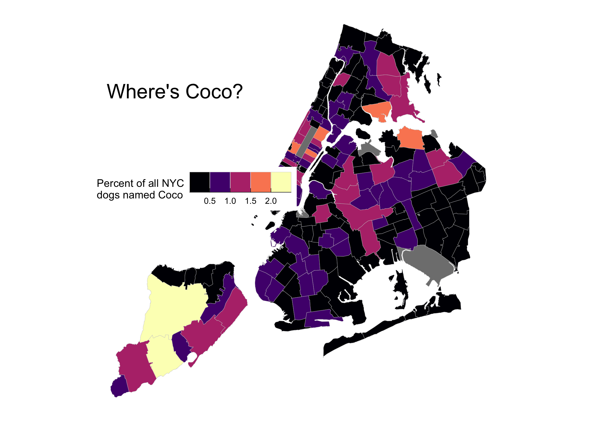

<!-- README.md is generated from README.Rmd. Please edit that file -->


# nycdogs 

<!-- badges: start -->
[](https://travis-ci.org/kjhealy/nycdogs)
<!-- badges: end -->


The `nycdogs` package contains three datasets, `nyc_license`, `nyc_bites`, and `nyc_zips`. They contain, respectively, data on all licensed dogs in New York city, data on reported dog bites in New York city, and geographical data for New York city at the zip code level.


## Installation

`nycdogs` is a data package, bundling several datasets into a convenient format. The relatively large size of the data in the package means it is not suitable for hosting on [CRAN](https://cran.r-project.org/), the core R package repository. There are two ways to install it.

### Install direct from GitHub

You can install the beta version of nycdogs from [GitHub](https://github.com/kjhealy/nycdogs) with:

``` r
devtools::install_github("kjhealy/nycdogs")
```

### Installation using `drat`

While using `install_github()` works just fine, it would be nicer to be able to just type `install.packages("nycdogs")` or `update.packages("nycdogs")` in the ordinary way. We can do this using Dirk Eddelbuettel's [drat](http://eddelbuettel.github.io/drat/DratForPackageUsers.html) package. Drat provides a convenient way to make R aware of package repositories other than CRAN.

First, install `drat`:


```r
if (!require("drat")) {
    install.packages("drat")
    library("drat")
}
```

Then use `drat` to tell R about the repository where `nycdogs` is hosted:


```r
drat::addRepo("kjhealy")
```

You can now install `nycdogs`:


```r
install.packages("nycdogs")
```

To ensure that the `nycdogs` repository is always available, you can add the following line to your `.Rprofile` or `.Rprofile.site` file:


```r
drat::addRepo("kjhealy")
```

With that in place you'll be able to do `install.packages("nycdogs")` or `update.packages("nycdogs")` and have everything work as you'd expect. 

Note that the drat repository only contains data packages that are not on CRAN, so you will never be in danger of grabbing the wrong version of any other package.


## Loading the data

The package works best with the [tidyverse](http://tidyverse.org/) libraries and the [simple features](https://r-spatial.github.io/sf/index.html) package for mapping.


```r
library(tidyverse)
library(sf)
#> Linking to GEOS 3.7.2, GDAL 2.4.2, PROJ 5.2.0
```

Load the data:


```r
library(nycdogs)
```

To look at the tibble that contains the licensing data, do this:


```r
nyc_license
#> # A tibble: 122,203 x 14
#>    animal_name animal_gender animal_birth_mo… breed_rc borough zip_code
#>    <chr>       <chr>         <date>           <chr>    <chr>      <int>
#>  1 Shadow      M             2000-01-01       Beagle   Brookl…    11236
#>  2 Rocco       M             2011-10-01       Boxer    Brookl…    11210
#>  3 Luigi       M             2005-09-01       Maltese  Bronx      10464
#>  4 Petunia     F             2013-08-01       Pug      Brookl…    11221
#>  5 Romeo       M             2008-10-01       Maltese  Bronx      10451
#>  6 Brandy      M             2004-01-01       Unknown  Brookl…    11225
#>  7 Sam         M             2011-05-01       Pug      Manhat…    10021
#>  8 May         F             2004-05-01       Unknown  Staten…    10305
#>  9 Ruby        F             2010-04-01       Boxer    Brookl…    11220
#> 10 Leo         M             2014-01-01       Beagle   Bronx      10468
#> # … with 122,193 more rows, and 8 more variables:
#> #   community_district <dbl>, census_tract2010 <dbl>, nta <chr>,
#> #   city_council_district <dbl>, congressional_district <dbl>,
#> #   state_senatorial_district <dbl>, license_issued_date <date>,
#> #   license_expired_date <date>
```

## Example

You can use the `nyc_zips` object to create a map of, for example, the prevalence of dog names by zip code:


```r

nyc_coco <- nyc_license %>%
    group_by(zip_code, animal_name) %>%
    tally() %>%
    mutate(freq = n / sum(n),
           pct = round(freq*100, 2)) %>%
    filter(animal_name == "Coco")

nyc_coco
#> # A tibble: 170 x 5
#> # Groups:   zip_code [170]
#>    zip_code animal_name     n    freq   pct
#>       <int> <chr>       <int>   <dbl> <dbl>
#>  1    10001 Coco            9 0.00994  0.99
#>  2    10002 Coco            7 0.00617  0.62
#>  3    10003 Coco            6 0.00389  0.39
#>  4    10004 Coco            1 0.00752  0.75
#>  5    10005 Coco            1 0.00346  0.35
#>  6    10007 Coco            5 0.0243   2.43
#>  7    10009 Coco            9 0.00427  0.43
#>  8    10010 Coco            9 0.00783  0.78
#>  9    10011 Coco           12 0.00537  0.54
#> 10    10012 Coco            2 0.00234  0.23
#> # … with 160 more rows

coco_map <- left_join(nyc_zips, nyc_coco)
#> Joining, by = "zip_code"


coco_map %>% ggplot(mapping = aes(fill = pct)) +
    geom_sf(color = "gray80", size = 0.1) +
    scale_fill_viridis_c(option = "A") +
    labs(fill = "Percent of\nLicensed Dogs named 'Coco'",
         title = "Where's Coco?") +
    theme_map() + 
    theme(legend.position = "left",
          panel.grid.major = element_line(color = "white"),
          legend.key = element_rect(color = "gray40", size = 0.1))
```


